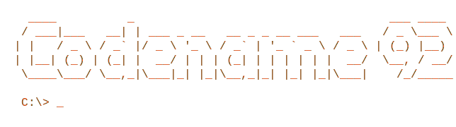

# Yevhen Chernenko

Senior Front-End Engineer @ GlobalLogic — Kyiv, Ukraine

## Stack

---

## Stats

---

## About

- 🎮 Started in game dev (2015) and moved to web (2019)
- 💾 Retro computing nerd. Happy place is roughly 1999–2006. Windows XP, DirectX 9, Daemon Tools, Nero Burning ROM, Alcohol 120%, Winamp, Total Commander. If any of these words put a smile on your face, we will probably get along.
- 🐧 My obsessions these days: Linux and open-source software, car culture, simracing, F1, PC and gaming-related hardware, tech in general.
- 🐱 Owned by a cat

